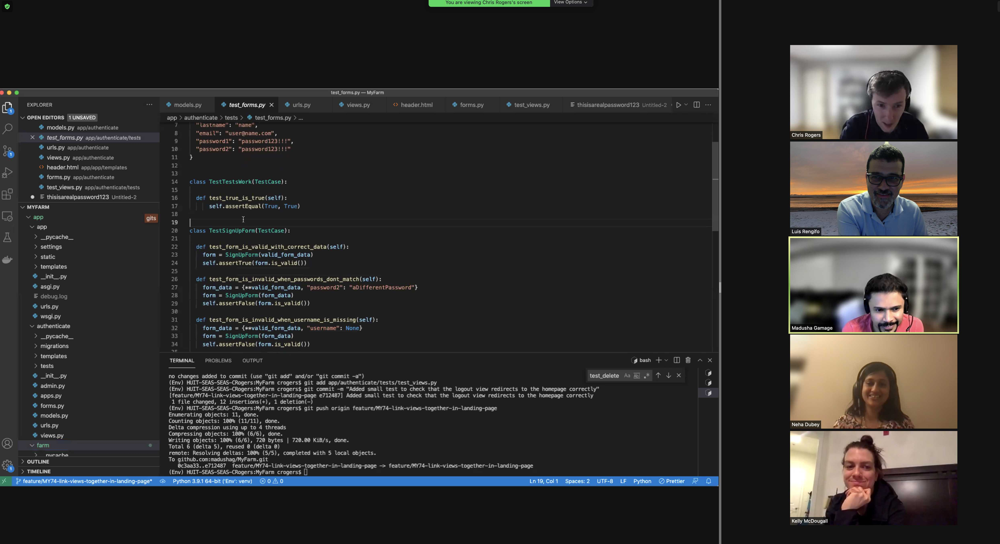
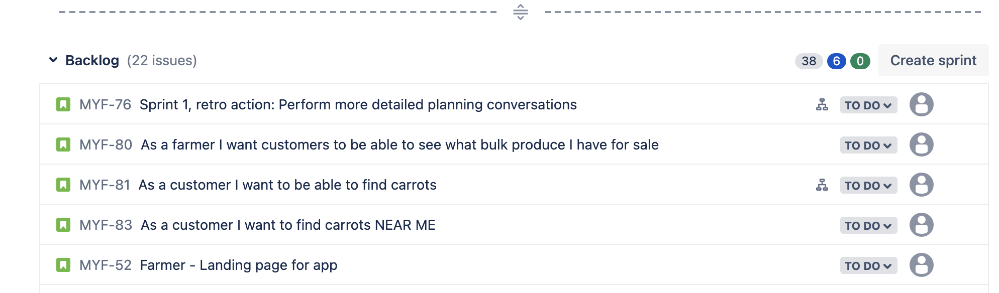
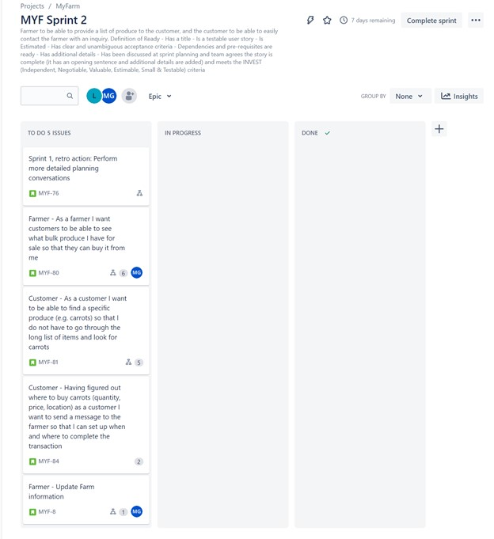
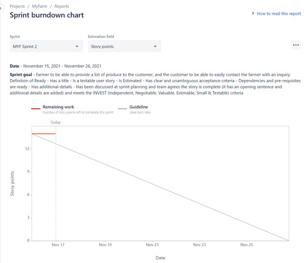
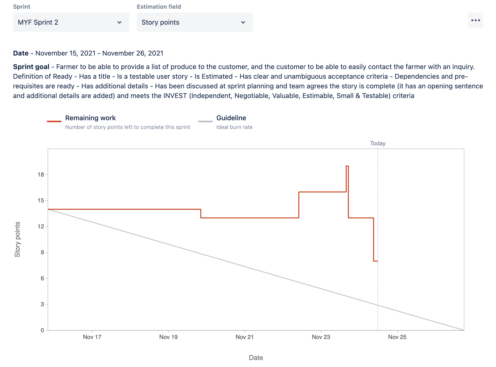
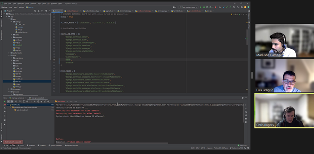
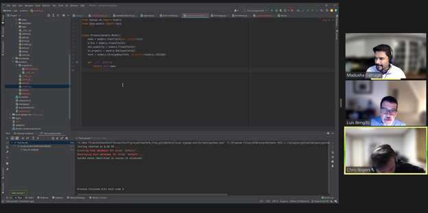

# MyFarm

## Project Part 1:

* We are Team 1 on Canvas
* Our team name is "Team MyFarm"
* Public Slack channel URL : https://app.slack.com/client/T4Q0SCW2K/C02J8D169RB
* Public git repo URL :  https://github.com/madushag/MyFarm
* Our product name is **"MyFarm"**

### Team

| Member Name               |   Role        |
|---------------------------|-------------  |
| Chris Rogers              | Developer     |
| Neha Dubey                | Developer     |
| Christian Calleri         | Scrum Master  |
| Shrikanth Ananthakrishnan | Product Owner |
| Luis Rengifo              | Developer     |
| Madusha Gamage            | Developer     |
| Kelly McDougall           | Developer     |

### Far Vision
Connecting farmers and consumers to make fresh produce more accessible 

### Near Vision (MVP)
To allow a farmer to manage an online farm that includes:
1. Subscription model information and number of slots available if any (e.g. CSA shares, fruit share, meat share)
2. Near real-time information on the farm's offerings for sale in the open market
3.  Connection points for the customer to pick up farm offerings 
    - drop off locations, farm stands, farmers' market
    - day and time
4. Farm location (geolocation) and description (a window-shopping portal for the farm)

### Stakeholder Types 
* Farmers
* Customers of farm products
* Suppliers to farmers

### Real stakeholder 1
* Ari Kurtz, 70, Male, and Moira O'Donnel, 65, Female 
* Occupation: Farmers, in Lincoln MA
Ari and Moira grow many types of vegetables and fruits during the farming season. They runs a CSA (Community supported agriculture) and also sells produce in the farmer's market. they also give a part of their produce to a local charity. As a farmer they offers CSA subscriptions through a mailing list and the local newspaper of the town. They have experienced the following problems: 
    - Outreach: Over the past few years they has seen their CSA membership decline. As a farmer outreach is a big challenge especially in the digital era, where the proportion of people accessing information through the traditional media is limited. Also maintaining a website is difficult.
    - Marketing excess produce: When there is surplus produce like hot peppers this year, the issues they face are 
        - They find it very difficut to find someone to buy them, whether small quantities or in bulk. They rely on a mailing list that most farmers in Massachusetts subscribe to, to market their produce
        - How to price the product so that it is attractive enough to buy, but at the same time they are not losing money. They compare prices in local stores and gustimate a selling price for their produce
        - How to make inventory available in realtime to customers  

### Real stakeholder 2
* Vijaya Meduri: Age 43, Female
* Occupation: Home maker, Acton MA
Vijaya is married and has a toddler and her spouse is a software professional. She is primarily responsible for providing food to her family. She is passionate about sourcing food from her local community. She buys fresh seasonal produce from locals farms and farm stands. The rough breakup  is 70% from the grocery store and 30% local farms, but she would like to increase the latter. She currently subscribes to a CSA but she also shops for produce that were scarce in her share or those she wants to store through winter. She gets her information in the following ways:
    - A mailing list where farmers advertise and request anything and everything to do with farming and fresh produce
    - Websites such as https://massnrc.org/farmlocator/map.aspx?Type=Organic%20Farms
    - pickyourown.org

She then calls individual farms to see what is availabe to buy/pick at that time (day or week) before heading there. She loves the fact that she is able to connect with her food source and also bring her child along to participate and play as an activity.

Her problems are: 
    - She has to spend a lot of time hunting for what she wants to buy locally.
    - While she is familiar with a few farms locally there are many around that she doesn't know of and what they offer.

She would like to have a website that gives her up to date information she needs about local farms within 20 miles from her home, their offerings and how and when she can buy produce from them. The most important aspect of buying from local farms is the sense of community and connection she feels with the local people.

### Ficticious stakeholder 3

* Mary Manhannan: Age 44 Female
* Occupation: Farmer in Pittsfield MA
Mary is a new farmer who is has taken a new entry farmers training program offered by the Tufft's University. As a part of the program she has been given land to grow vegetables and hopes to run a small CSA with a few members as an experiment. As a new entrant she needs the following:
    - A portal to host and market her virtual farm
    - Ability to sell CSA shares online and attract customers
If her venture works out she hopes to eventually lease some land and make farming her full time profession

### Product Backlog
Our product backlog will be managed using Jira (https://txmd-webops.atlassian.net/jira/software/projects/MYF/boards/1/backlog). We currently have more than 10 PBIs and they are all expressed as a true user story. We ordered the backlog based on the functionality that is needed to create a fluid and logical user experience ("Business Value"), and then taking into account pre-requisite/dependencies between tasks.

#### Definition of ready for our user stories
- Has a title
- Is a testable user story
- Is Estimated
- Has clear and unambigous acceptance criteria
- Dependencies and pre-requisites are ready
- Has additional details
- Has been discussed at sprint planning and team agrees the story is complete (it has an opening sentence and additional details are added) and meets the INVEST (Independent, Negotiable, Valuable, Estimable, Small & Testable) criteria

#### Estimation technique
We used the affinity estimation method using buckets/categories on a scale of 1 (Smallest) through 5 (Largest). The developers estimated the first 10 PBIs in story points using relative sizing and grouped them into each bucket. For example, while a PBI with an estimate of 2 story points was placed in bucket 1, a PBI with an estimate of 6 (3x) story points was placed in bucket 3.

Only developers participated in estimating each PBI. 

A recording of the Zoom session where we did most of this estimation can be viewed here : https://harvard.zoom.us/rec/share/7RBYFAdnjYFj7M_tqM7k6Ete0iwUiOPJSvVqJa8oiax1v3fMKXk3Ua7RgLjeHyHi.oCFtfjU87kVOR5-V. 
Some of the estimation and grouping was done asynchronously via Slack. 

## Project Part 2
### Sprint Planning

Sprint Planning took place on Nov. 1 - all members participated in the session; however, **only the developers participated in the forecast exercise.**

The session was divided in three parts: 1) Why is this Sprint valuable, 2) What can be done this Sprint and 3) How will the chosen work get done:

#### 1) Why is this Sprint Valuable
This sprint is valuable because it will allow us to understand the Minimum Viable Product from our main stakeholder's perspective, and because it will allow the Team to develop the technical foundation to develop the solution.
##### Sprint Goal: To allow a farmer to log in and create a farm.

#### 2) What can be done this Sprint?
The team reviewed the stories in the backlog and decided to focus on the minimum functionality required by the farmer to login to the MyFarm system and create a new farm. In addition, the team decided that the Django framework will allow pretty quick development of the MVP; since not all of the developers are familiar with Django, a use story was added to train the team. The following stories were added to the Sprint: Django Training for the team; Research > Exploration Story - Add a location; Farmer - Create a New Account; Farmer - Portal Login; Farmer - Create a new farm; Farmer - Update Farm Information.

#### 3) How will the chosen work get done
Here the team developed the forecast for the Sprint.

##### Forecast

The forecast for the number of story points the team can complete during the sprint is 20. The number is an "educated guess" based on the developers' assesment on learning and applying the technology for the project and prior experience with databases and the web forms to create and save the data.

- You pulled stories into your sprint backlog: YES
- You pulled stories from the top of your product backlog: YES
- The aggregate size of the stories does not exceed your forecast: YES
- Only developers participated in the pointing activity: YES

- You decomposed user stories into developer tasks: YES 
- The tasks are clearly listed in your sprint backlog: YES. Developer tasks are attached to each story.

**Our Sprint backlog's Kanban Board:**

Our sprint backlog is shown above. The URL of the board is : https://txmd-webops.atlassian.net/jira/software/projects/MYF/boards/1. 

At the end of the meeting, the team pulled the stories as the top of the backlog into Sprint 1; we made sure that the aggregate size did not exceed the forecast.

**Note** - To view the stories that were pulled into Sprint 1, please follow the below URL, change the filter to "MYF Sprint 1", and scroll towars the bottom of the page.

https://txmd-webops.atlassian.net/jira/software/projects/MYF/boards/1/reports/burndown?source=sidebar

**The Burndow Chart for Sprint 1:**

URL of the burndown chart(please change filter to Sprint 1): https://txmd-webops.atlassian.net/jira/software/projects/MYF/boards/1/reports/burndown

### Daily Scrums
The team meets Mondays, Wednesdays and Fridays to discuss progress of the Sprint. During the Sprint, the team met on 11/1, 11/3, 11/5, 11/8, 11/10 and 11/12.

A recording of a daily scrum: https://harvard.zoom.us/rec/share/R392t2uv9eFuXIPVt3dw7sQvuzcFhrum2mKPUJWnqZOTiqbOMSoi611EfF05sUWs.i_SdBZ-ntBZ0iEpe

Progress is updated in Jira using the Kanban Board:

The URL of the Kanban Board is: https://txmd-webops.atlassian.net/jira/software/projects/MYF/boards/1

##### Daily Scrum 11/1
Completed in the last 24 hours:
- Chris Rogers: Prepare training materials
- Madusha Gamage: Did Django Tutorial and set up development environment
- Kelly McDougall: Setup development environment
- Neha Dubey: Setup Django.
- Chris Calleri: Researched potential UI designs.
- Luis Rengifo: Setup development environment
- Shrikanth Ananthakrishnan: Discussed with farmer the MVP

will work on next:
- All: conduct training session tonight.

Impediments: none

##### Daily Scrum 11/3
Completed since our last meeting:
- Chris Rogers: Developed architectural model for solution.
- Madusha Gamage: Create database model for a farm
- Kelly McDougall: Researched potential use of Google plug in for location.
- Neha Dubey: Created Django form to allow farmer to log in

Will work on next:
- Chris and Kelly: Admin Interface and base.html.
- Madusha: Create view to receive farm data, setup docker environment
- Neha and Luis: Work on login code.

Impediments: none

##### Daily Scrum 11/5
Completed since last meeting
- Chris and Kelly: Admin Interface;
- Madusha : setup docker environment, created view to receive add farm data

Will work on next:
- Chris and Kelly: will continue pair programming of the combined tasks
- Neha and Luis: will continue pair programming.
- Madusha: create views and templates to update farm data, add tests

Impediments: 
- Madusha: Unable to get postgresql to work in docker. Will instead use SQLLite and local environment to develop and test

##### Daily scrum 11/8
Completed since last meeting:
- Chris and Kelly: Created view to allow creation of account.
- Madusha: Created an update view for farms and tests

Will work on next:
- Chris and Kelly: start merging changes into main branch.
- Madusha: Refactor code for update view of farms.
- Neha and Luis: made changes on login code based on feedback from team.

Impediments: Feedback from Richard from first project deliverable has indicated that the focus of the team has been more on the technology rather than the real value that our main stakeholder will get from the solution. The team may need to pivot.

##### Daily scrum 11/10
Completed since last meeting:
- Chris and Kelly: review various pull requests from the team and merged into main branch.
- Madusha: Finished code for update view; obtained meeting with Anu to discuss missed deliverable.
- Neha and Luis: finished tests for login view.

Will work on next:
- All: prepare for discussion with Anu.
- Madusha : Add delete farm functionality and tests, refactor views to use Django forms

Impediments: 
- All: Need to meet with our main stakeholder to determine how to pivot.
- Madusha : Do not know how Django forms work. Will self-study/learn on Django forms to accomplish sprint goal.

##### Daily scrum 11/12
Completed since last meeting:
- Chris and Kelly: merged new changes from team.
- Neha and Luis: refactored login functionality.
- Madusha: added more tests, refactored to use forms and pull request to merge changes

Will work on next:
- All: prepare for conversation with stakeholder.

Impediments: Determine how to pivot - meeting with stakeholder on 11/14 at 7 pm.

#### Burndow Chart as of Nov. 5:

#### Burndown Chart at the end of the Sprint:

#### Pair Programming:
Neha and Luis Pair Programming: https://harvard.zoom.us/rec/share/5vED4_sZOFj_9sMcZHZB-eimVthwHXQL5l27k3K4Z6aG1Pjj9NRCAPN2BSReiHw.kV5-n1uW7L3lbvOL?startTime=1636589132000

Kelly and Chris Pair Programming: https://harvard.zoom.us/rec/share/EMsUUaM3kSBEW2e-uHSLICeAKLQyvuVIJ34uvtOzNKHVboUJ03iqUmB_8NGq9gPo.QGTikupl1cie4coR?startTime=1635984983000

#### Mob Programming:
The developers in a mob programming session:

#### Test Driven Development.

URLs in Github to all of the tests conducted:
https://github.com/madushag/MyFarm/blob/dev/app/farm/tests.py
https://github.com/madushag/MyFarm/blob/dev/app/authenticate/tests/test_forms.py
https://github.com/madushag/MyFarm/blob/dev/app/authenticate/tests/test_views.py

Started adding tests first:

Added more failing tests to cover required functionality:

Added code to then turn those wicked red tests to go green:

Followed TDD and finally have a test suit with 28 tests that covers most of the functionalty we added this sprint:

### Product Increment - Working Software
The product is installed in an EC2 instance.
The URL is: http://54.226.105.77/

Image of the working product:

### Sprint Review
The Sprint Review took place on 11/14 at 7 pm. In attendance were Ari Kurtz, our farmer stakeholder and Vijaya Meduri, our customer stakeholder. The Scrum Team presented to the stakeholders the results of the the work and progress toward the product goal.

Recording of the Sprint Review can be found here: 
https://harvard.zoom.us/rec/share/003xRbYk2VcjeM1RbeBIt9m09u2EkDbfMrbGCLve70tubLyWrUQDJ6h95ui3AA_8.CaBosaO5hzDrh2Cu?startTime=1636934489000

**Note: feedback from Ari, our farmer stakeholder can be found at minute 21. Feedback from Vijaya, our customer stakeholder can be found at minute 31.**

Based on the feedback from Ari and Vijaya, the product backlog was amended to more adequately reflect the features that would add value to them. For example, features MYF-80, MYF-81 and MYF-84 were added to the backlog - links to each of these three below:

MYF-80: https://txmd-webops.atlassian.net/jira/software/projects/MYF/boards/1/backlog?selectedIssue=MYF-80
MYF-81: https://txmd-webops.atlassian.net/jira/software/projects/MYF/boards/1/backlog?selectedIssue=MYF-81
MYF-82: https://txmd-webops.atlassian.net/jira/software/projects/MYF/boards/1/backlog?selectedIssue=MYF-84

### Sprint Retrospective
The Sprint Restrospective took place on 11/14 as well, right after the Sprint Review. The team discussed ways to increase quality and effectiveness.

Recording of the Sprint Retrospective can be found here:
https://harvard.zoom.us/rec/share/003xRbYk2VcjeM1RbeBIt9m09u2EkDbfMrbGCLve70tubLyWrUQDJ6h95ui3AA_8.CaBosaO5hzDrh2Cu?startTime=1636937858000

The teams discussed the following action, which should make the team significantly better:
**Perform more detailed Planning Conversations**
* Agree upon coding standards and conventions
* Read out and refine acceptance criteria for all stories in a sprint as a group
* Only include technical tasks within stories

It is at the top of the backlog for Sprint 2:

As a reminder, URL to the backlog is: https://txmd-webops.atlassian.net/jira/software/projects/MYF/boards/1/backlog

## Project Part 3 

### Sprint Planning

**Recording of the session:** https://harvard.zoom.us/rec/share/tryF4_Ovq7pUoEn9w1VF8Jk1oTaAMA8XSUbHV8_0eQzcz3ryRccrotsWjfBayFQZ.hStQw-QvCMEFIUbL

Sprint Planning took place on Nov. 15 - all members participated in the session; however, **only the developers participated in the forecast exercise.**

The session was divided in three parts: 1) Why is this Sprint valuable, 2) What can be done this Sprint and 3) How will the chosen work get done:

#### 1) Why is this Sprint Valuable
This sprint is valuable because we have a much better understanding of what will bring value to our farmer stakeholder and to our customer stakeholder. We have pivoted from our first Sprint, and have a better understanding of our capacity. The forecast this time around should be better.

Based on the feedback from Ari and Vijaya, the team reworked the stories in the backlog, and resorted them based on what is most valuable to our stakeholder. The stories were also assigned story points based on our prior experience.

##### Sprint Goal: 

Enable the farmer to provide a list of produce to potential customers, and allow the customers to easily contact the farmer with an inquiry.

#### 2) What can be done this Sprint?

In Sprint 1 the team accomplished 14 points.

We agreed that as the team gets more familiar with the development tools, we should be able to complete 14 points this sprint as well, despite the holiday in week 2.

#### 3) How will the chosen work get done
Here the team developed the forecast for the Sprint.

##### Forecast

As indicated aboveThe forecast for the number of story points the team can complete during the sprint is 20. The number is an "educated guess" based on the developers' assesment on learning and applying the technology for the project and prior experience with databases and the web forms to create and save the data.

We pulled stories into the sprint backlog. 
The stories were pulled from the top of the product backlog. The backlog had been sorted by what will add the most value.
We confirmed that the aggregate size of the stories did not exceed the forecast.
Only the developers participated in the forecasting.

**Our Sprint backlog's Kanban Board:**

Our sprint backlog is shown above. The URL of the board is : https://txmd-webops.atlassian.net/jira/software/projects/MYF/boards/1
**Note** this URL shows the Kanban board for the active Sprint. As of 11/16, the board was as depicted above, with the tasks MYF-76, MYF-80, MYF-81, MYF-84 and MYF-8. Links to these tasks below:

MYF-77: https://txmd-webops.atlassian.net/jira/software/projects/MYF/boards/1?selectedIssue=MYF-76
MYF-80: https://txmd-webops.atlassian.net/jira/software/projects/MYF/boards/1?selectedIssue=MYF-80
MYF-81: https://txmd-webops.atlassian.net/jira/software/projects/MYF/boards/1?selectedIssue=MYF-81
MYF-84: https://txmd-webops.atlassian.net/jira/software/projects/MYF/boards/1?selectedIssue=MYF-84
MYF-8: https://txmd-webops.atlassian.net/jira/software/projects/MYF/boards/1?selectedIssue=MYF-8

At the end of the meeting, the team pulled the stories as the top of the backlog into Sprint 1; we made sure that the aggregate size did not exceed the forecast.

**The Burndow Chart for Sprint 2:**

URL of the burndown chart: 
**Note:** Please make sure that the filter is set to MYF-Sprint2.

### Daily Scrums
The team meets Mondays, Wednesdays and Fridays to discuss progress of the Sprint. During the Sprint, the team met on 11/15, 11/17, 11/19, 11/22, 11/24 and 11/26.

A recording of a daily scrum: https://harvard.zoom.us/rec/share/H5e_8POVDciWos7smd1LfvDIcCdGjsu0RsmVeOZwdJz2_1xf-U9rJrFJpQ8auevh.Jhm4HzWa4le558K2

Progress is updated in Jira using the Kanban Board:

The URL of the Kanban Board is: 

##### Daily Scrum 11/15
Completed since our last meeting:
- All: conducted Sprint Review and Sprint Retrospective.

will work on next:
- Sprint planning 

Impediments: None at this time.

##### Daily Scrum 11/17
Completed since our last meeting:
- Chris Rogers: Implemented the Continuous Integration setup in GitHub.
- Chris R., Madusha, Luis: mob programming session on story MYF-80. Created the model for the story.
- Madusha: Planning the template for MYF-80.

Will work on next:
- Chris R. MYF-81, including setup of CI/CD.
- Madusha and Kelly: MYF-80
- Neha and Luis: MYF-84
- Neha will watch the mob programming video to catch-up on CI setup.

Impediments: 

##### Daily Scrum 11/19
Completed since last meeting

Will work on next:

Impediments: 
    - All: understand how to use the CI/CD pipeline.

##### Daily scrum 11/22
Completed since last meeting:
    - Chris Rogers: further developed the CI/CD pipelines.
    - Madusha and Kelly: continued to move forward the MYF-80 story.

Will work on next:
    - Chris Rogers: the filter for the produce view.

Impediments: 

##### Daily scrum 11/24
Completed since last meeting:

Will work on next:
    - Chris Rogers: filtering functionality.
    - Neha and Luis: email functionality.

Impediments: 
    - Neha and Luis: understanding how to code email functionality in Django framework.
    
Burndown Chart as of 11/24:

##### Daily scrum 11/12
Completed since last meeting:

Will work on next:

Impediments: 

#### Burndown Chart as of Nov. 17:

#### Burndown Chart at the end of the Sprint:

#### Pair Programming:

#### Mob Programming:
Madusha, Chris and Luis mob programming:

#### Test Driven Development.
Test Failed:

Test Passed:

### Product Increment - Working Software
The product is installed in an EC2 instance.
The URL is: http://myfarmalb-1945437152.us-east-1.elb.amazonaws.com/

Image of the working product:

### Sprint Review
The Sprint Review took place on 11/28 at 7 pm. In attendance were Ari Kurtz, our farmer stakeholder and Vijaya Meduri, our customer stakeholder. The Scrum Team presented to the stakeholders the results of the the work and progress toward the product goal.

Recording of the Sprint Review can be found here: 

### Sprint Retrospective
The Sprint Restrospective took place on 11/14 as well, right after the Sprint Review. The team discussed ways to increase quality and effectiveness. In particular,

Recording of the Sprint Retrospective can be found here:

The team discussed the following action, which should make the team significantly better:

It is at the top of the backlog for Sprint 3:

As a reminder, URL to the backlog is:

### Continuous Integration

### Continuous Delivery

